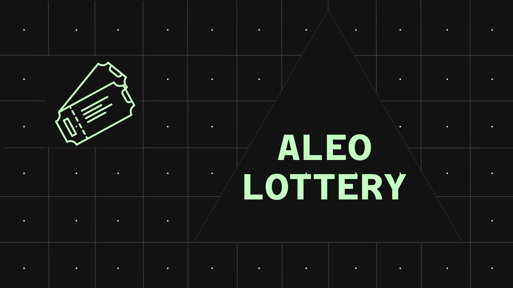

# Lottery Smart Contract For Aleo - Wright Lottery

## Discord - vadimwright

## Introduction

The "Wright Lottery" smart contract is designed to facilitate a lottery system on the Aleo blockchain platform. This contract allows participants to buy tickets, accumulate funds in the lottery pool, and eventually determine a winner. Below, we provide a professional README explaining the contract's structure and functions.

## Table of Contents

1. [Smart Contract Overview](#smart-contract-overview)
2. [Key Components](#key-components)
    - [Participant Structure](#participant-structure)
    - [Lottery State](#lottery-state)
3. [Functions](#functions)
    - [initialize_lottery](#initialize_lottery)
    - [buy_ticket](#buy_ticket)
    - [finish](#finish)
4. [Usage](#usage)
5. [License](#license)

## Smart Contract Overview

The "Wright Lottery" smart contract on the Aleo blockchain is a decentralized lottery system. It is built to ensure fairness and transparency in lottery drawings. Participants can buy tickets using cryptocurrency, and the winnings are distributed among the lucky winners.

## Key Components

### Participant Structure

The Participant structure represents an individual who has purchased a lottery ticket. It includes the following fields:
- `participant_address`: The Aleo address of the participant.
- `amount`: The amount of cryptocurrency the participant has contributed to the lottery.

### Lottery State

The Lottery State stores information about the current state of the lottery. It includes the following fields:
- `owner`: The Aleo address of the lottery owner, who has the authority to finish the lottery.
- `total_amount`: The total amount of cryptocurrency accumulated in the lottery pool.
- `participants_amount`: The total count of participants who have purchased lottery tickets.

## Functions

### initialize_lottery

This function initializes the lottery by setting the initial state. It can only be called once, and it returns the lottery state after initialization.

### buy_ticket

The `buy_ticket` function allows participants to buy lottery tickets. It checks if the provided amount is greater than zero, calculates the new total amount, and increments the participant count. A new lottery state is created with updated values. This function also calls the `finalize` function to update the participant mapping.

### finalize (Internal Function)

The `finalize` function updates the participant mapping with the participant's address and the amount they have contributed to the lottery.

### finish

The `finish` function is used to conclude the lottery. Only the owner of the lottery can call this function. It calculates the prize for the winner, determines the winner's address (randomly for simplicity), and transfers the prize to the winner. It also calculates the owner's commission and sends it to the contract owner (self.caller).

## Usage

1. Initialize the lottery using the `initialize_lottery` function.
2. Participants can buy tickets using the `buy_ticket` function by specifying their address and the amount.
3. The owner of the lottery can conclude the lottery using the `finish` function, which determines the winner and distributes prizes.

## License

This "Wright Lottery" smart contract is provided under the [MIT License](LICENSE). You are free to use, modify, and distribute it as per the terms of the license.

**Note**: This README provides a high-level overview of the smart contract. To deploy and use the contract, ensure you have the necessary tools and permissions on the Aleo blockchain platform.
